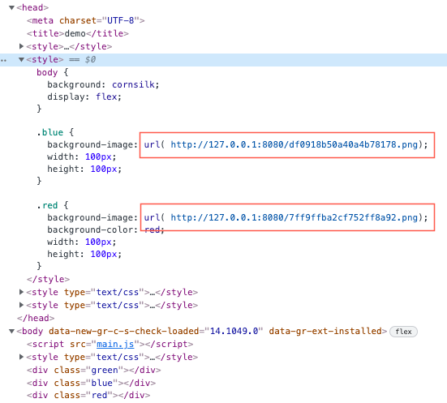
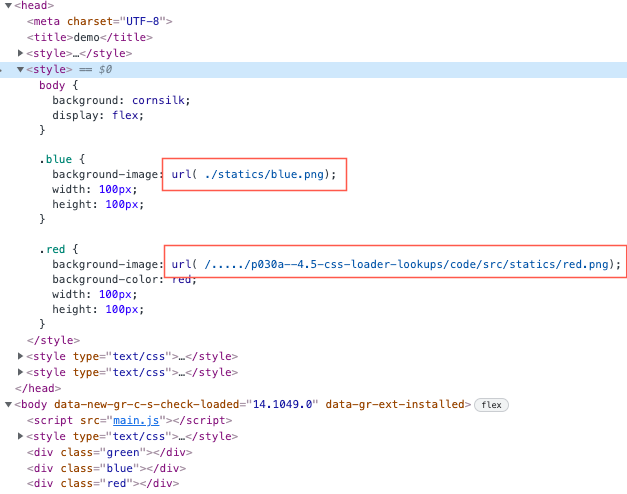

# 4.5 Understanding css-loader lookups


The author said:

> Even though the loader handles absolute and relative imports by default, it doesn’t work with root relative imports - url("/static/img/demo.png").

But  I am unable to reproduce the bug mentioned in text:

Use device URI works, relative URI also works: 

```css
@import '/Users/...../p030a--4.5-css-loader-lookups/code/statics/green.css';

body {
  background: cornsilk;
  display: flex;
}

.blue {
  background-image: url( ./statics/blue.png);
  width: 100px;
  height: 100px;
}

.red {
  background-image: url( /Users/..../p030a--4.5-css-loader-lookups/code/src/statics/red.png);
  background-color: red;
  width: 100px;
  height: 100px;
}
```

```css
.green {
  background-image: url(../src/statics/green.png);
  width: 100px;
  height: 100px;
}
```


---

The following are the injected css in style tag:




## What happen when css-loader options.url is set to `false`:

When  css-loader options.url is set to `false`:

```javascript
const loadCSS = () => {
  const out = {
    module: {
      rules: [
        {
          test: /\.css$/,
          use: [
            'style-loader',
            {
              loader: 'css-loader',
              options: {
                // url: true
                url: false  // <--- set to false
              }
            }
          ]
        }
      ]
    }
  }
  return out
}
```


css-loader will not parse any paths specified in url: 


