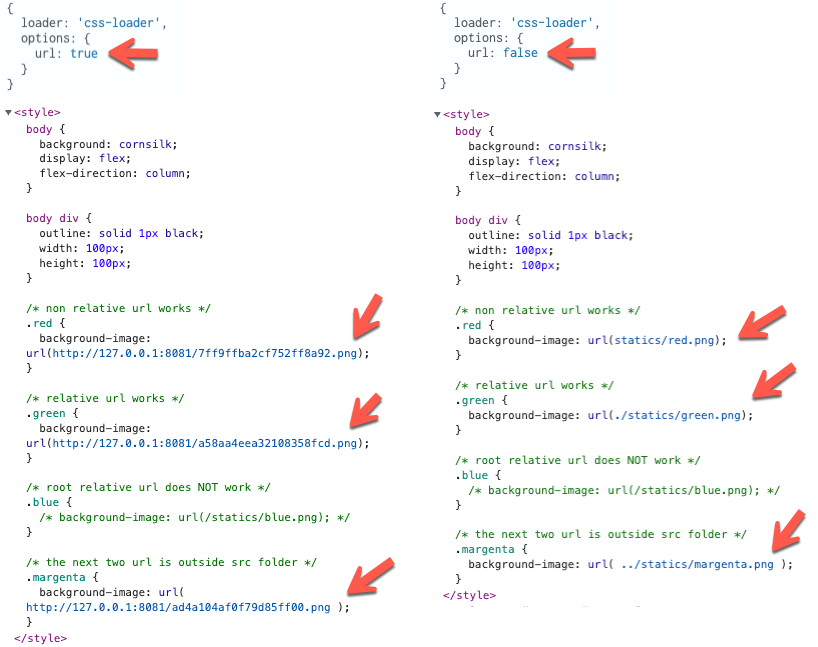

# 4.5 Understanding css-loader lookups

## What happen when css-loader, url is set to false


```
 // file: wepack.parts.js
   
  module: {
      rules: [
        {
          test: /\.css$/,
          use: [
            'style-loader',
            {
              loader: 'css-loader',
              options: {
                url: false // <----- !!
              }
            }
          ]
        }
      ]
    }
```


