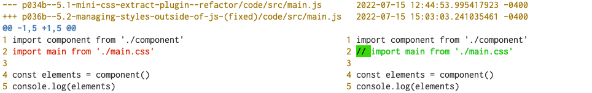

# 5.2 Managing styles outside of JavaScript (fixed)

p036a--5.2-managing-styles-outside-of-js-(fixed)/

---

In this example we no longer import css in our src/*.js. See below the statement in line 2 is commented out:





Instead we have a separate entry point for css in our webpack.config.js's `commonConfig` :

```js
const commonConfig = merge([
  {
    entry: {
      main: [ './src/main.js' ],
      style: glob.sync('./src/**/*.css')
         //                       ^^^^
         // Although entry point is css, it
         // is loaded through style.js
    }
  },
  part_page({title:'demo'}),
])
```

Webpack will generate a file `style.js` to load this css file using the css-loader or extract-css:


