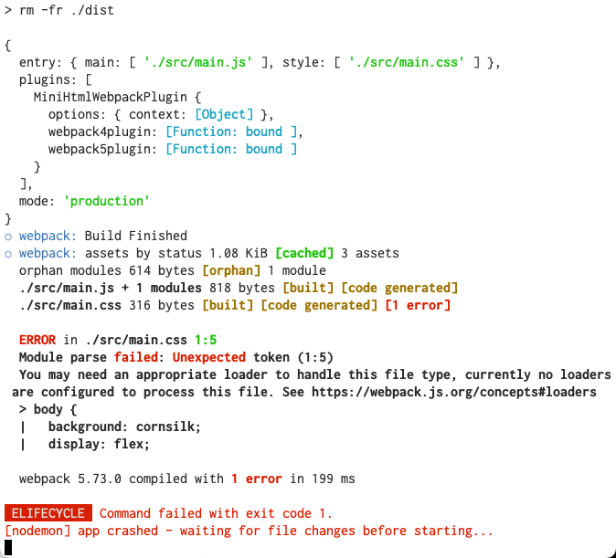

# 5.2 Managing styles outside of JavaScript

p036a--5.2-managing-styles-outside-of-js-(not-working)

I can't get this to work. Error: 

I think this is because entry point has to be javascript. 

The following are possible solutions; need more research:

https://stackoverflow.com/questions/48843690/use-sass-as-a-entry-point-in-webpack

https://florianbrinkmann.com/en/webpack-sass-multiple-entry-points-5351/

