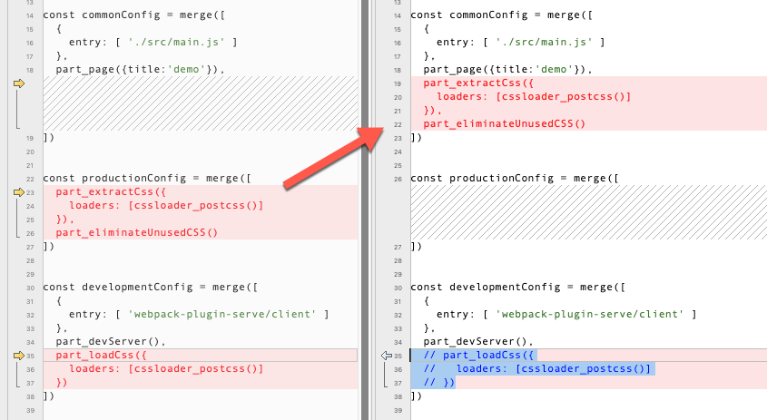

# Extract css during development

We can also extract css during development:

left:   p041a--6.2-enabling-purgecss
right: p041b--extract-css-during-development

Maybe this is better because we can be more confident that what we see during development is consistent with production.

