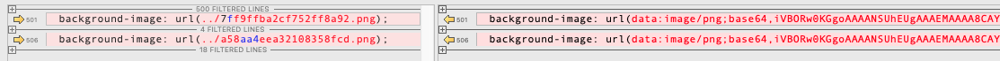

# 9.1 Integrating-images-to-the-project

Prior to webpack 5 asset loading is accomplished with `raw-loader`, `url-loader` , and `file-loader`. In webpack 5 these loaders are replaced by the built-in [asset-modules](https://webpack.js.org/guides/asset-modules/). 

```js
// file: ..../p057a--9.1a-integrating-images-to-the-project/code/webpack/webpack-part--load-images.js

const loadImages = (
  { limit } = { limit: 1 * 1024 }
) => {
  const module = {
    rules: [
      {
        test: /\.(png|jpg)$/,
        type: 'asset',
        parser: {
          dataUrlCondition: {
            maxSize: limit // if images size is less than limit, injected into the bundle as a Base64-encoded string.
          }
        }
      }
    ]
  }

  return {
    module
  }
}


module.exports = loadImages
```

The property `module.rules[type]` controls the behaviour of Assets Modules. When value `module.rules[type]` is `"asset"`,  the behavior of the asset emmiting depending on the asset size, control by the property [Rule.parser.dataUrlCondition.maxSize](https://webpack.js.org/configuration/module/#ruleparserdataurlcondition). If a module source size is less than `maxSize` then module will be injected into the bundle as a Base64-encoded string, otherwise module file will be emitted into the output directory.


## Result:

Left: .../p044a--7.2a-defining-a-browserslist/code/dist--dev
Right: .../p057a--9.1a-integrating-images-to-the-project/code/dist--dev




