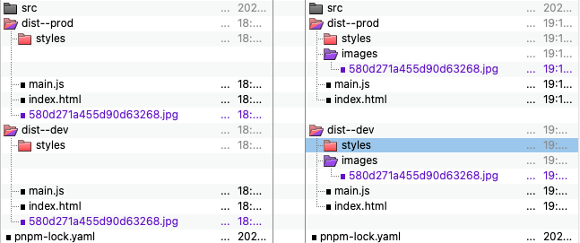

# 9.1 Integrating-images-to-the-project

## output-assetModuleFilename

[output.assetModuleFilename](https://webpack.js.org/configuration/output/#outputassetmodulefilename) field can be used to control where the assets are emitted:

```js
// file: .../code/webpack/webpack-part--load-images.js

const loadImages = (
  { limit } = { limit: 1 * 1024 }
) => {
  const module = {
    rules: [
      {
        test: /\.(png|jpg)$/,
        type: 'asset',
        parser: {
          dataUrlCondition: {
            maxSize: limit // if images size is less than limit, injected into the bundle as a Base64-encoded string.
          }
        }
      }
    ]
  }

  return {
    output: {
      assetModuleFilename: 'images/[hash][ext][query]',  
    },
    module
  }
}


module.exports = loadImages
```


## Result:

Left: .../p057a--9.1a-integrating-images-to-the-project/code/
Right: .../9.1b-output-assetModuleFilename/code/




